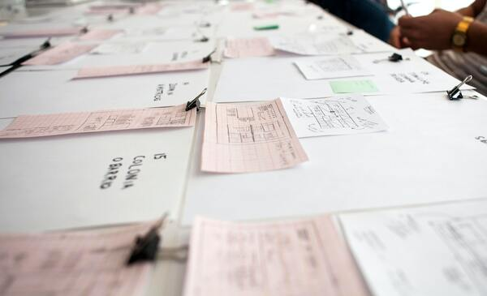

# Seguimiento de tareas



## :point_up: Antes de empezar: algunos consejos

El enunciado tiene **mucha** información, van a necesitar leerlo varias veces. La sugerencia es que lo lean entero una vez (para tener una idea general) y luego vuelvan a consultarlo las veces que hagan falta.

Concentrensé en los requerimientos y, excepto que se traben mucho, respeten el orden sugerido. No es necesario que hagan TDD, pero sí sería interesante que vayan creando las distintas clases y métodos a medida que resuelven cada requerimiento y no antes. 

En otras palabras: trabajen completando cada requerimiento antes de pasar al siguiente, con los tests que aseguran que funciona incluidos. Si al avanzar en los requerimientos les parece necesario refactorizar, adelante, van a tener los tests que garantizan que no rompieron nada. :smirk: 

## :bookmark_tabs: Descripción del dominio

Una consultora de software necesita implementar un sistema para hacer el seguimiento del desarrollo de tareas. A estas tareas las clasificaremos en dos tipos distintos: **simples** y **de integración**.

### Tareas simples

Cada tarea simple tiene una cantidad de **horas estimadas** para ser terminada, algunos **empleados** asignados y un **responsable** - que no es más que un empleado que asume ese rol particular para esa tarea (podría ocurrir perfectamente que sea empleado en otra tarea). De cada empleado se conoce **cuánto cobra por hora** trabajada. Las **horas necesarias** para finalizar una tarea son las horas estimadas que requiere divido la cantidad de empleados que tiene asignados (sin contar al responsable de la misma, que no aporta nada para reducir este número).

El costo de una tarea simple es el **costo de la infraestructura** necesaria para llevarla a cabo (que se configura para cada tarea) más los salarios que les corresponden a cada uno de los empleados asignados por cada hora que tuvieron que trabajar. Al responsable se le paga la totalidad de las horas estimadas de la tarea.

Esto mismo, en pseudocódigo, sería así:

```
Costo de Tarea Simple = 
  Sumatoria de (Horas de trabajo de cada empleado * Sueldo por hora de cada empleado)
  + Horas estimadas * Sueldo del responsable 
  + Costo de infraestructura
  
Horas de trabajo de cada empleado = Horas estimadas / Cantidad de empleados
```

### Tareas de integración

Este tipo de tareas consisten en coordinar otras tareas. Las tareas de integración no tienen un costo propio por infraestructura, ni empleados directamente a cargo, aunque sí tienen un responsable.

Las **horas necesarias** para realizarla se calculan como la suma de las horas necesarias para cumplir sus subtareas, más una hora para reuniones de planificación por cada 8 horas de trabajo. Se considera que su **costo** es la suma de los costos de sus subtareas más un bonus que se le paga al responsable, equivalente al 3% de esa suma. Para la **nómina de empleados**, se debe incluir a las nóminas de las subtareas más al responsable de la tarea de integración.

El sistema debe poder soportar que una tarea de integración tenga como subtarea tanto a tareas simples como a tareas de integración.

## :heavy_check_mark: Requerimientos

Se pide resolver los siguientes requerimientos **sin** utilizar casteos ni chequeos de tipo (o sea, no vale usar `as` ni `is`). 

1. Poder consultar la nómina de empleados de una tarea (una lista), conformada por sus empleados y su responsable. 
1. Saber cuántas horas se necesitan para finalizar una tarea.
1. Obtener el costo de una tarea.
1. Incorporar al modelo las tareas de integración.

## :fountain_pen: Licencia

Esta obra fue elaborada por [Federico Aloi](https://github.com/faloi) y publicada bajo una [Licencia Creative Commons Atribución-CompartirIgual 4.0 Internacional][cc-by-sa].

[![CC BY-SA 4.0][cc-by-sa-image]][cc-by-sa]

[cc-by-sa]: https://creativecommons.org/licenses/by-sa/4.0/deed.es
[cc-by-sa-image]: https://licensebuttons.net/l/by-sa/4.0/88x31.png

### Créditos

:memo: [Enunciado original](https://sites.google.com/site/utndesign/material/guia-de-ejercicios/guia-objetos-patrones/tareas) creado por [Fernando Dodino](https://github.com/fdodino) y equipo de Diseño de Sistemas de Información (UTN - FRBA).

:camera_flash: Imagen de portada por <a href="https://unsplash.com/@brandsandpeople?utm_source=unsplash&utm_medium=referral&utm_content=creditCopyText">Brands&People</a> en <a href="https://unsplash.com/s/photos/papers?utm_source=unsplash&utm_medium=referral&utm_content=creditCopyText">Unsplash</a>.
